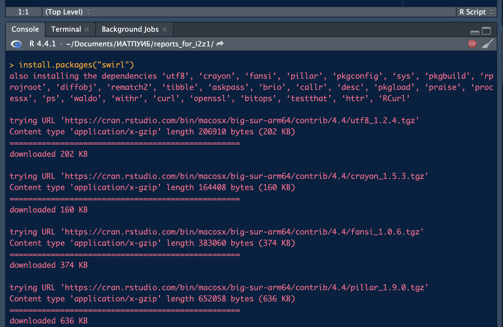
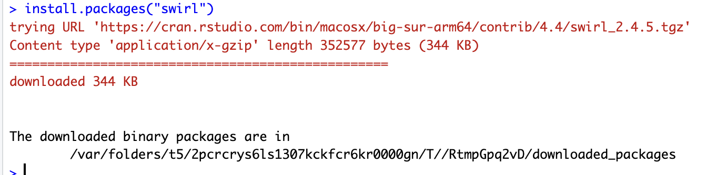
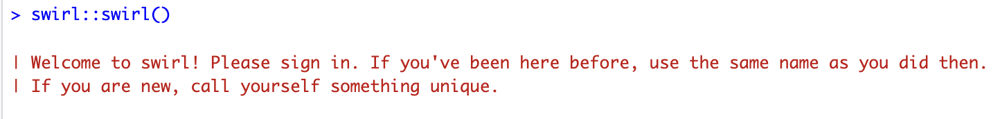
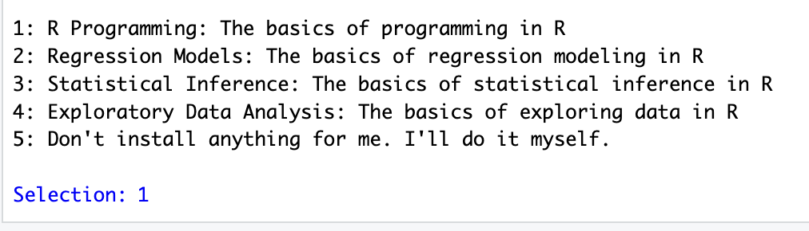
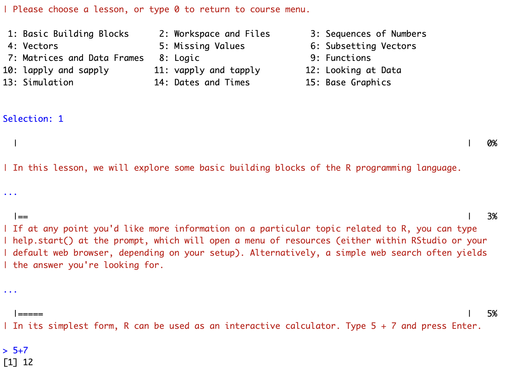
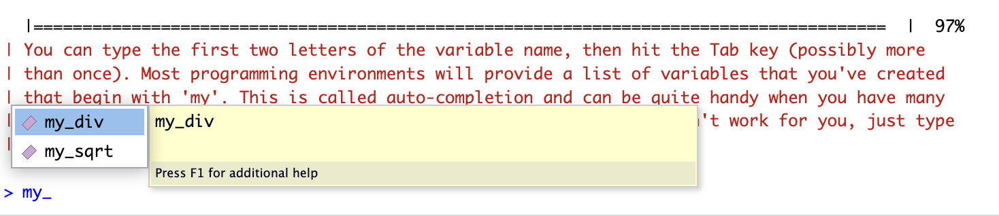

# Название

Введение в R

## Цель

1.  Развить практические навыки использования языка программирования R для обработки данных
2.  Развить навыки работы в Rstudio IDE:
    -   установка пакетов
    -   работа с проектами в Rstudio
    -   настройка и работа с Git
3.  Закрепить знания базовых типов данных языка R и простейших операций с ними

## Исходные данные

1.  Ноутбук
2.  Условие для практической работы

## Общий план выполнения

1.  Установить интерпретатор R
2.  Установить Rstudio IDE
3.  Установить программный пакет swirl
4.  Запустить задание с помощью swirl::swirl()
5.  Выбрать из меню курсов
6.  Запустить подкурсы и выполнить:
    -   базовые структурные блоки (Basic Building Blocks)
    -   рабочие пространства и файлы (Workspace and Files)
    -   последовательности чисел (Sequences of Numbers)
    -   векторы (Vectors)
    -   пропущенные значения (Missing Values)
7.  Составить отчет и выложить его и исходный qmd/rmd файл в свой репозиторий

### Шаг 1

Данный шаг был выполнен в предыдушей работе.

### Шаг 2

Данный шаг был выполнен в предыдушей работе.

### Шаг 3

Установим программный пакет swirl с помощью функции R install.packages(“swirl”)



Пакет установлен



### Шаг 4

Запустим задание с помощью команды swirl::swirl() 

### Шаг 5

Выберём необходимый курс 

### Шаг 6

#### Basic Building Blocks

Выберём необходимый подкурс базовые структурные блоки (Basic Building Blocks) 

Вычислим сумму двух чисел:

``` r
5 + 7
```

```         
[1] 12
```

Запищем результат суммы в переменную:

``` r
x <- 5 + 7
```

Выведём её значение:

``` r
x
```

```         
[1] 12
```

Введём новую переменную y с значением x - 3

``` r
y <- x - 3
```

Выведём её значение

``` r
y
```

```         
[1] 9
```

Создадим вектор с(1.1, 9, 3.14)

``` r
c(1.1, 9, 3.14)
```

```         
[1] 1.10 9.00 3.14
```

Присвоим этот вектор переменной z

``` r
z <- c(1.1, 9, 3.14)
```

``` r
?c
```

Выведём значения из вектора

``` r
z
```

```         
[1] 1.10 9.00 3.14
```

``` r
c(z, 555, z)
```

```         
[1]   1.10   9.00   3.14 555.00   1.10   9.00   3.14
```

Арифметические операции с вектором:

``` r
z * 2 + 100
```

```         
[1] 102.20 118.00 106.28
```

Запишем результат в преременную my_sqrt:

``` r
my_sqrt <- z * 2 + 100
```

Посмотрим как происходит вычисление корня

``` r
sqrt(z - 1)
```

```         
[1] 0.3162278 2.8284271 1.4628739
```

Запишем результат в переменную:

``` r
my_sqrt <- sqrt(z - 1)
```

``` r
my_sqrt
```

```         
[1] 0.3162278 2.8284271 1.4628739
```

``` r
my_div <- z/my_sqrt
```

``` r
my_div
```

```         
[1] 3.478505 3.181981 2.146460
```

Сложение векторов

``` r
c(1, 2, 3, 4) + c(0, 10)
```

```         
[1]  1 12  3 14
```

``` r
c(1, 2, 3, 4) + c(0, 10, 100)
```

```         
Warning in c(1, 2, 3, 4) + c(0, 10, 100): longer object length is not a
multiple of shorter object length

[1]   1  12 103   4
```

Во вотром случае получаем ошибку, делаем вывод, что длина первого вектора должна быть кратна длине второго вектора

При помощи стрелочки вверх можно выводить предыдушие строки кода.

При помощи tab можно дописывать название переменной, если она была использовани ранее.



#### Workspace and Files

Путь по файла:

``` r
getwd()
```

```         
[1] "/Users/elinapacina/Documents/ИАТПУИБ/reports_for_i2z1/pr1"
```

Объявленные переменные:

``` r
ls()
```

```         
[1] "my_div"  "my_sqrt" "x"       "y"       "z"      
```

``` r
x <- 9
```

``` r
ls()
```

```         
[1] "my_div"  "my_sqrt" "x"       "y"       "z"      
```

Файлы в дирректории:

``` r
list.files()
```

```         
 [1] "folder1"          "img"              "mytest2.R"        "mytest3.R"       
 [5] "README.html"      "README.md"        "README.qmd"       "README.rmarkdown"
 [9] "testdir"          "testdir2"        
```

``` r
?list.files()
```

Возможные аргументы функции:

``` r
args(list.files)
```

```         
function (path = ".", pattern = NULL, all.files = FALSE, full.names = FALSE, 
    recursive = FALSE, ignore.case = FALSE, include.dirs = FALSE, 
    no.. = FALSE) 
NULL
```

Запишем данную дирректорию в переменную old.dir:

``` r
old.dir <- getwd()
```

Создадим новую дирректорию:

``` r
dir.create("testdir")
```

```         
Warning in dir.create("testdir"): 'testdir' already exists
```

Перейдём в эту дирректорию:

``` r
setwd("testdir")
```

Создадим новый файл:

``` r
file.create("mytest.R")
```

```         
[1] TRUE
```

Проверим, что файл создан:

``` r
list.files()
```

```         
 [1] "folder1"          "img"              "mytest.R"         "mytest2.R"       
 [5] "mytest3.R"        "README.html"      "README.md"        "README.qmd"      
 [9] "README.rmarkdown" "testdir"          "testdir2"        
```

Проверим, что файл существует:

``` r
file.exists("mytest.R")
```

```         
[1] TRUE
```

Посмотрим информацию о файле:

``` r
file.info("mytest.R")
```

```         
         size isdir mode               mtime               ctime
mytest.R    0 FALSE  644 2024-09-23 09:48:09 2024-09-23 09:48:09
                       atime uid gid       uname grname
mytest.R 2024-09-23 09:48:09 501  20 elinapacina  staff
```

Переименуем файл:

``` r
file.rename("mytest.R", "mytest2.R")
```

```         
[1] TRUE
```

Скопируем файл:

``` r
file.copy("mytest2.R", "mytest3.R")
```

```         
[1] FALSE
```

Укажем относительный путь до файла:

``` r
file.path("mytest3.R")
```

```         
[1] "mytest3.R"
```

Создадим новые папки:

``` r
file.path("folder1", "folder2")
```

```         
[1] "folder1/folder2"
```

Создадим одну папку в другой:

``` r
 dir.create(file.path('testdir2', 'testdir3'), recursive = TRUE)
```

```         
Warning in dir.create(file.path("testdir2", "testdir3"), recursive = TRUE):
'testdir2/testdir3' already exists
```

Вернёмся в исходную дирректореторию

``` r
setwd(old.dir)
```

#### Sequences of Numbers

Сгенерируем числа от 1 до 20:

``` r
1:20
```

```         
 [1]  1  2  3  4  5  6  7  8  9 10 11 12 13 14 15 16 17 18 19 20
```

Сгенерируем 10 дробных чисел:

``` r
pi:10
```

```         
[1] 3.141593 4.141593 5.141593 6.141593 7.141593 8.141593 9.141593
```

Сгенерируем числа от 15 до 1:

``` r
15:1
```

```         
 [1] 15 14 13 12 11 10  9  8  7  6  5  4  3  2  1
```

Сгенерируем числа от 1 до 20 с шагом 1 при помощи функции seq:

``` r
seq(1, 20)
```

```         
 [1]  1  2  3  4  5  6  7  8  9 10 11 12 13 14 15 16 17 18 19 20
```

Сгенерируем числа от 1 до 10 с шагом 0.5 при помощи функции seq:

``` r
seq(0, 10, by=0.5)
```

```         
 [1]  0.0  0.5  1.0  1.5  2.0  2.5  3.0  3.5  4.0  4.5  5.0  5.5  6.0  6.5  7.0
[16]  7.5  8.0  8.5  9.0  9.5 10.0
```

Сгенерируем 30 чисел от 5 до 10:

``` r
seq(5, 10, length=30)
```

```         
 [1]  5.000000  5.172414  5.344828  5.517241  5.689655  5.862069  6.034483
 [8]  6.206897  6.379310  6.551724  6.724138  6.896552  7.068966  7.241379
[15]  7.413793  7.586207  7.758621  7.931034  8.103448  8.275862  8.448276
[22]  8.620690  8.793103  8.965517  9.137931  9.310345  9.482759  9.655172
[29]  9.827586 10.000000
```

Запишем это значение в переменную my_seq:

``` r
my_seq <- seq(5, 10, length=30)
```

Посмотрим длину полученной переменной:

``` r
length(my_seq)
```

```         
[1] 30
```

Сгенерируем числа от 1 до длины переменной my_seq:

``` r
1:length(my_seq)
```

```         
 [1]  1  2  3  4  5  6  7  8  9 10 11 12 13 14 15 16 17 18 19 20 21 22 23 24 25
[26] 26 27 28 29 30
```

``` r
seq(along.with = my_seq)
```

```         
 [1]  1  2  3  4  5  6  7  8  9 10 11 12 13 14 15 16 17 18 19 20 21 22 23 24 25
[26] 26 27 28 29 30
```

``` r
seq_along(my_seq)
```

```         
 [1]  1  2  3  4  5  6  7  8  9 10 11 12 13 14 15 16 17 18 19 20 21 22 23 24 25
[26] 26 27 28 29 30
```

Сгенерируем вектор длиною 40 со всеми нулями:

``` r
rep(0, times = 40)
```

```         
 [1] 0 0 0 0 0 0 0 0 0 0 0 0 0 0 0 0 0 0 0 0 0 0 0 0 0 0 0 0 0 0 0 0 0 0 0 0 0 0
[39] 0 0
```

Сгенерируем вектор длиною 10 со значениями из вектора (0, 1, 2)

``` r
rep(c(0, 1, 2), times = 10)
```

```         
 [1] 0 1 2 0 1 2 0 1 2 0 1 2 0 1 2 0 1 2 0 1 2 0 1 2 0 1 2 0 1 2
```

Теперь хотим получить в резцльтате отсортированные значения:

``` r
rep(c(0, 1, 2), each = 10)
```

```         
 [1] 0 0 0 0 0 0 0 0 0 0 1 1 1 1 1 1 1 1 1 1 2 2 2 2 2 2 2 2 2 2
```

#### Vectors

Создадим вектор с значениями 0.5, 55, -10, 6

``` r
c(0.5, 55, -10, 6)
```

```         
[1]   0.5  55.0 -10.0   6.0
```

``` r
num_vect <- c(0.5, 55, -10, 6)
```

``` r
num_vect < 1
```

```         
[1]  TRUE FALSE  TRUE FALSE
```

``` r
tf <- num_vect < 1
```

``` r
tf
```

```         
[1]  TRUE FALSE  TRUE FALSE
```

``` r
num_vect >= 6
```

```         
[1] FALSE  TRUE FALSE  TRUE
```

Создадим вектор из строк:

``` r
my_char <- c("My", "name", "is")
```

``` r
my_char
```

```         
[1] "My"   "name" "is"  
```

Выведём значения из вектора:

``` r
paste(my_char, collapse = " ")
```

```         
[1] "My name is"
```

Добавим имя в полученный вектор:

``` r
c(my_char, "El")
```

```         
[1] "My"   "name" "is"   "El"  
```

``` r
my_name <- c(my_char, "El")
```

``` r
my_name
```

```         
[1] "My"   "name" "is"   "El"  
```

``` r
paste(my_name, collapse = " ")
```

```         
[1] "My name is El"
```

Соедининение нескольких строк:

``` r
paste("Hello", "world!", sep = " ")
```

```         
[1] "Hello world!"
```

Соединение нескольких векторов:

``` r
paste(1:3, c("X", "Y", "Z"), sep = "")
```

```         
[1] "1X" "2Y" "3Z"
```

``` r
paste(LETTERS, 1:4, sep = "-")
```

```         
 [1] "A-1" "B-2" "C-3" "D-4" "E-1" "F-2" "G-3" "H-4" "I-1" "J-2" "K-3" "L-4"
[13] "M-1" "N-2" "O-3" "P-4" "Q-1" "R-2" "S-3" "T-4" "U-1" "V-2" "W-3" "X-4"
[25] "Y-1" "Z-2"
```

#### Missing Values

``` r
x <- c(44, NA, 5, NA)
```

``` r
x * 3
```

```         
[1] 132  NA  15  NA
```

``` r
y <- rnorm(1000)
```

``` r
z <- rep(NA, 1000)
```

``` r
my_data <- sample(c(y, z), 100)
```

``` r
my_na <- is.na(my_data)
```

``` r
my_na
```

```         
  [1] FALSE FALSE  TRUE FALSE FALSE FALSE  TRUE FALSE FALSE FALSE FALSE FALSE
 [13] FALSE FALSE  TRUE  TRUE FALSE  TRUE FALSE FALSE  TRUE FALSE  TRUE  TRUE
 [25]  TRUE FALSE  TRUE FALSE  TRUE FALSE FALSE  TRUE  TRUE  TRUE  TRUE FALSE
 [37] FALSE  TRUE FALSE FALSE  TRUE  TRUE FALSE FALSE FALSE  TRUE  TRUE  TRUE
 [49] FALSE FALSE FALSE FALSE  TRUE FALSE FALSE  TRUE FALSE  TRUE  TRUE  TRUE
 [61] FALSE  TRUE FALSE  TRUE  TRUE FALSE FALSE FALSE FALSE  TRUE  TRUE FALSE
 [73]  TRUE  TRUE FALSE  TRUE  TRUE  TRUE  TRUE FALSE  TRUE  TRUE FALSE FALSE
 [85] FALSE  TRUE  TRUE  TRUE  TRUE  TRUE FALSE FALSE FALSE  TRUE FALSE FALSE
 [97]  TRUE FALSE  TRUE  TRUE
```

``` r
my_data == NA
```

```         
  [1] NA NA NA NA NA NA NA NA NA NA NA NA NA NA NA NA NA NA NA NA NA NA NA NA NA
 [26] NA NA NA NA NA NA NA NA NA NA NA NA NA NA NA NA NA NA NA NA NA NA NA NA NA
 [51] NA NA NA NA NA NA NA NA NA NA NA NA NA NA NA NA NA NA NA NA NA NA NA NA NA
 [76] NA NA NA NA NA NA NA NA NA NA NA NA NA NA NA NA NA NA NA NA NA NA NA NA NA
```

``` r
sum(my_na)
```

```         
[1] 48
```

``` r
my_data
```

```         
  [1] -0.98623312 -1.42555143          NA -1.81047269  0.20375095 -1.72706899
  [7]          NA  1.38074267  0.22105067 -1.95612981 -0.32858398 -1.09853574
 [13] -1.25147167  0.76906884          NA          NA -0.55819815          NA
 [19]  1.36119691 -1.06935580          NA -1.11564117          NA          NA
 [25]          NA  0.01832284          NA -0.19724160          NA  0.40201561
 [31]  0.39920073          NA          NA          NA          NA -1.69965433
 [37]  0.76411658          NA  0.77105693  2.21382938          NA          NA
 [43]  0.32243924 -1.85275466  0.69054283          NA          NA          NA
 [49] -1.25927459 -0.18696534 -1.48667058  0.67443623          NA -1.98549377
 [55]  2.18440430          NA  0.68840095          NA          NA          NA
 [61] -0.61238463          NA -0.70832701          NA          NA  1.92724177
 [67]  1.17134493  0.36721848  1.96573603          NA          NA -0.10271946
 [73]          NA          NA  1.65060402          NA          NA          NA
 [79]          NA -1.01664953          NA          NA  0.41102297  1.18685598
 [85] -0.53826618          NA          NA          NA          NA          NA
 [91]  0.54839717 -1.73220595  0.77906388          NA -0.59267438  0.93396616
 [97]          NA  0.98404624          NA          NA
```

``` r
0/0
```

```         
[1] NaN
```

``` r
Inf - Inf
```

```         
[1] NaN
```
