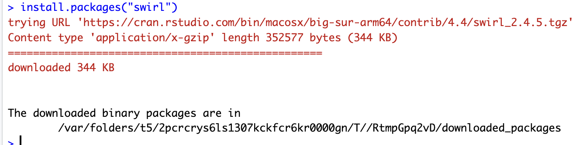
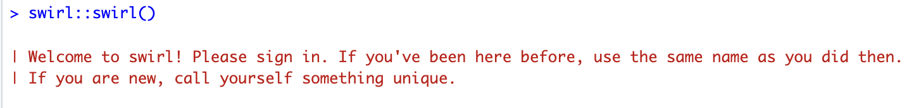
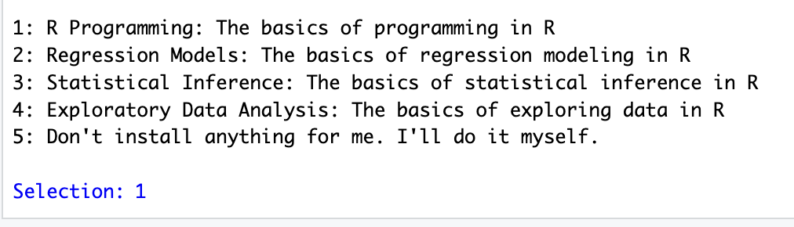
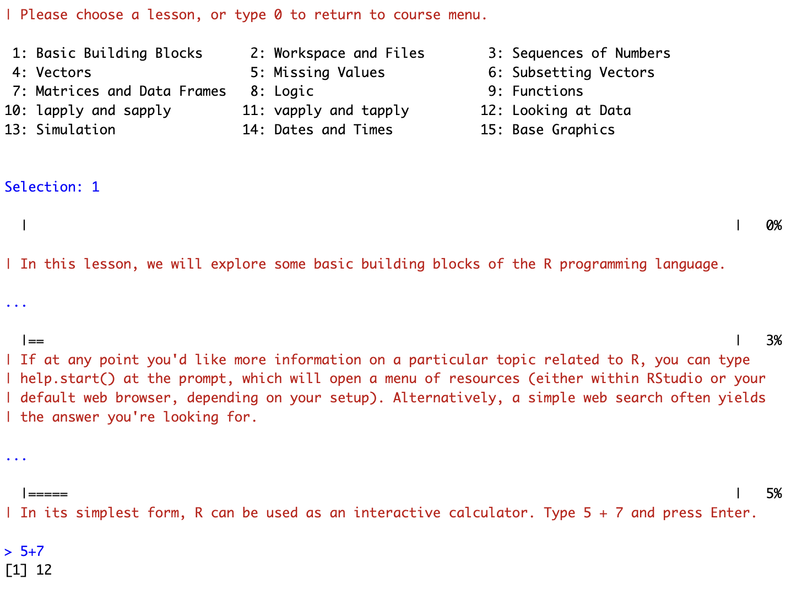

# README


# Название

Введение в R

## Цель

1.  Развить практические навыки использования языка программирования R
    для обработки данных
2.  Развить навыки работы в Rstudio IDE:
    -   установка пакетов
    -   работа с проектами в Rstudio
    -   настройка и работа с Git
3.  Закрепить знания базовых типов данных языка R и простейших операций
    с ними

## Исходные данные

1.  Ноутбук
2.  Условие для практической работы

## Общий план выполнения

1.  Установить интерпретатор R
2.  Установить Rstudio IDE
3.  Установить программный пакет swirl
4.  Запустить задание с помощью swirl::swirl()
5.  Выбрать из меню курсов
6.  Запустить подкурсы и выполнить:
    -   базовые структурные блоки (Basic Building Blocks)
    -   рабочие пространства и файлы (Workspace and Files)
    -   последовательности чисел (Sequences of Numbers)
    -   векторы (Vectors)
    -   пропущенные значения (Missing Values)
7.  Составить отчет и выложить его и исходный qmd/rmd файл в свой
    репозиторий

### Шаг 1

Данный шаг был выполнен в предыдушей работе.

### Шаг 2

Данный шаг был выполнен в предыдушей работе.

### Шаг 3

Установим программный пакет swirl с помощью функции R
install.packages(“swirl”)


Пакет установлен



### Шаг 4

Запустим задание с помощью команды swirl::swirl() 

### Шаг 5

Выберём необходимый курс 

### Шаг 6

Выберём необходимый подкурс базовые структурные блоки (Basic Building
Blocks) 

Вычислим сумму двух чисел:

``` r
5 + 7
```

    [1] 12

Запищем результат суммы в переменную:

``` r
x <- 5 + 7
```

Выведём её значение:

``` r
x
```

    [1] 12

Введём новую переменную y с значением x - 3

``` r
y <- x - 3
```

Выведём её значение

``` r
y
```

    [1] 9

Создадим вектор с(1.1, 9, 3.14)

``` r
c(1.1, 9, 3.14)
```

    [1] 1.10 9.00 3.14

Присвоим этот вектор переменной z

``` r
z <- c(1.1, 9, 3.14)
```

``` r
?c
```

Выведём значения из вектора

``` r
z
```

    [1] 1.10 9.00 3.14

``` r
c(z, 555, z)
```

    [1]   1.10   9.00   3.14 555.00   1.10   9.00   3.14

Арифметические операции с вектором:

``` r
z * 2 + 100
```

    [1] 102.20 118.00 106.28

Запишем результат в преременную my_sqrt:

``` r
z * 2 + 100
```

    [1] 102.20 118.00 106.28
