# Название

Подготовка воспроизводимых отчетов

## Цель

1.  Развить практические навыки использования современного стека воспроизводимых исследований
2.  Закрепить знания о современных сетевых протоколах прикладного уровня

## Исходные данные

1.  Ноутбук
2.  Условие для практической работы

## Общий план выполнения

1.  Установить сам язык программирования R
2.  Установить RStudio
3.  Создать новый проект
4.  Подключить github
5.  Создать папку в проекте для практики 1
6.  Написать отчет

### Шаг 1

Устанавливаем язык R из открытых источников 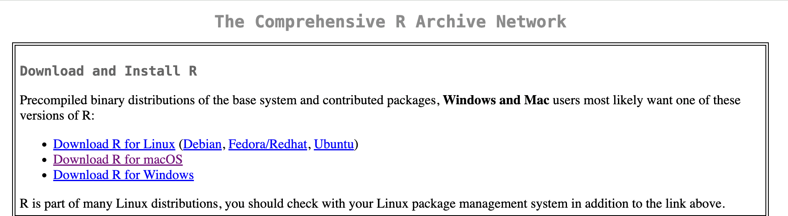

### Шаг 2

Устанавливакм RStudio из открытых источников 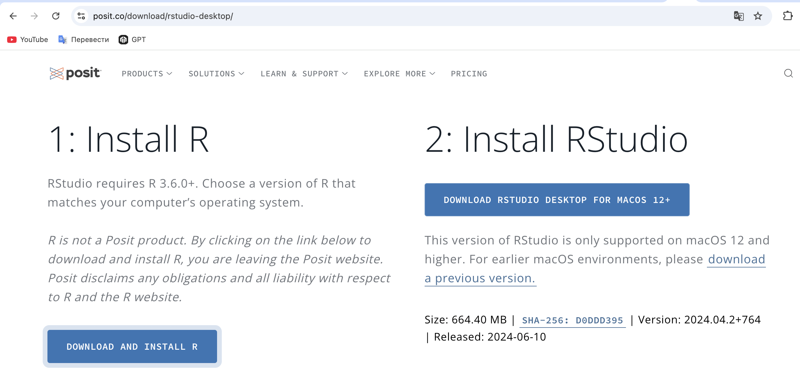

### Шаг 3

Создаем новый проект 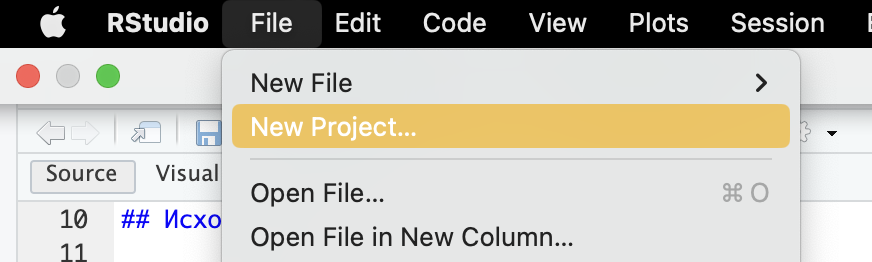 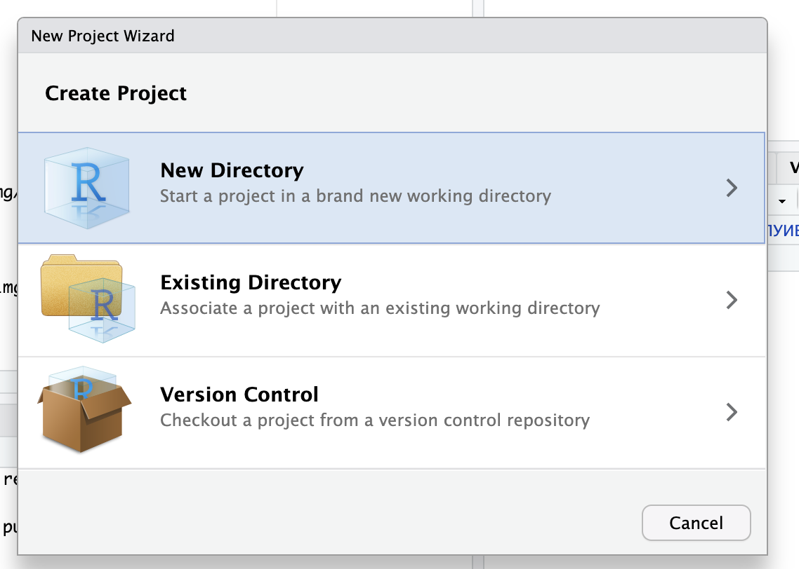 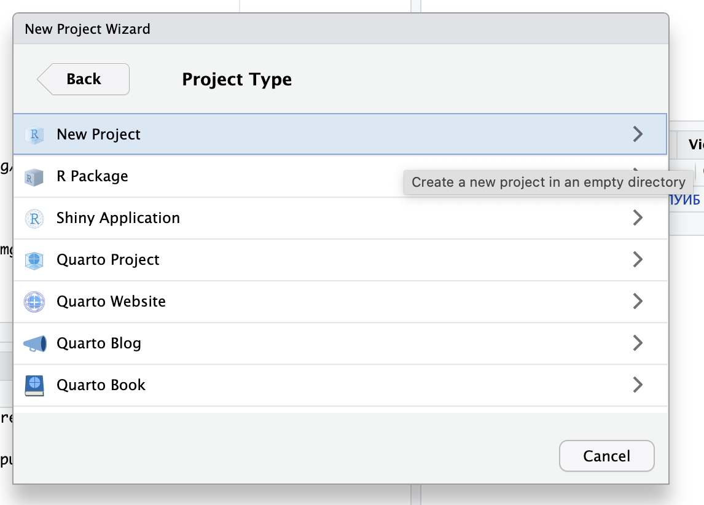 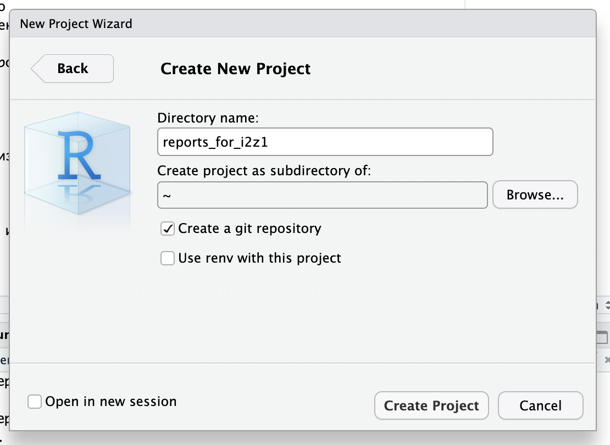

### Шаг 4

Создаём новый пустой репризиторий 

Создаём файл-описание, коммитим его через интерфейс. Подключаемся к гиту 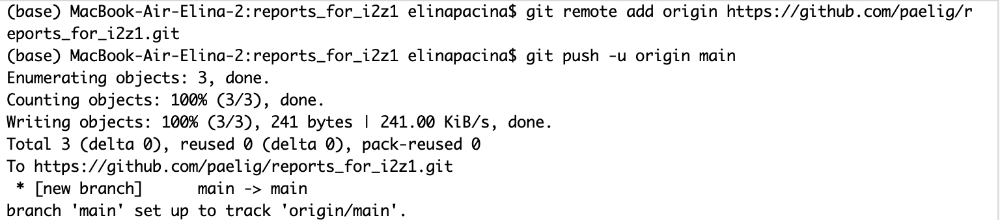

### Шаг 5

Создаём новую папку в проекте для практики 1 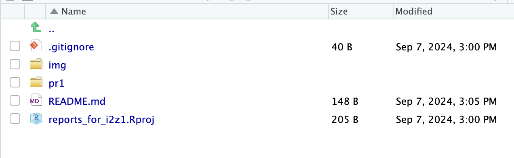

### Шаг 6

Создаём новый файл для отчёта 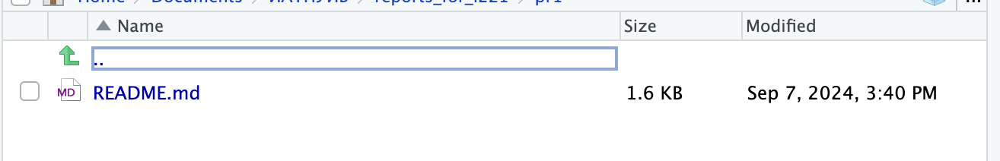

Пишем отчет 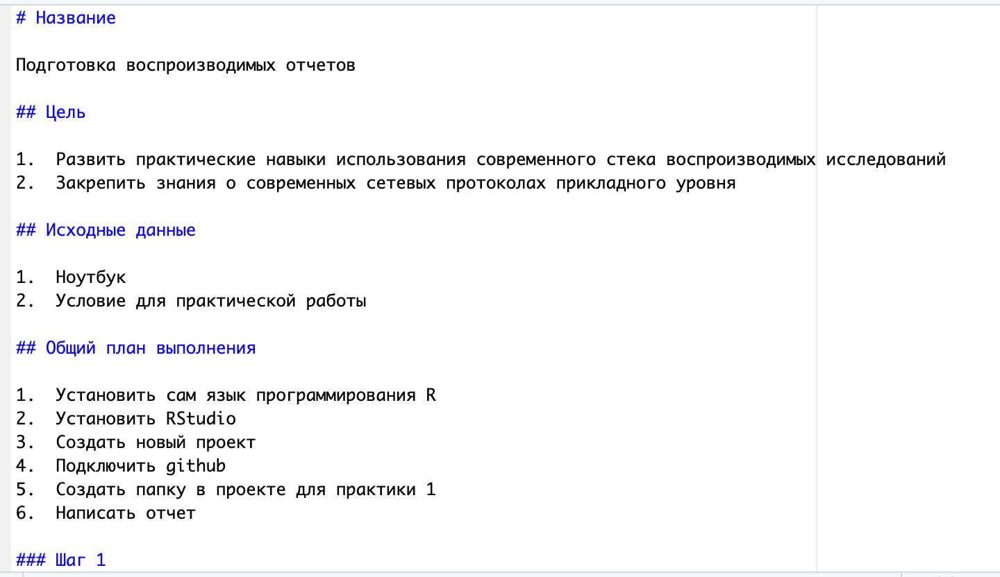

Сохраняем изменения, делаем коммит 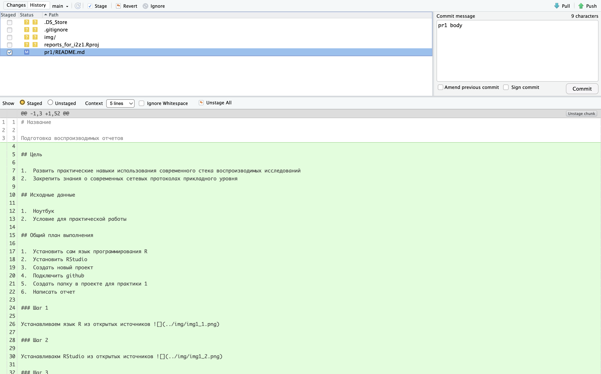

Пушим файл в репризиторий 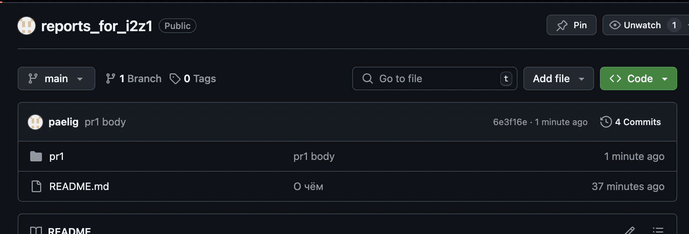
