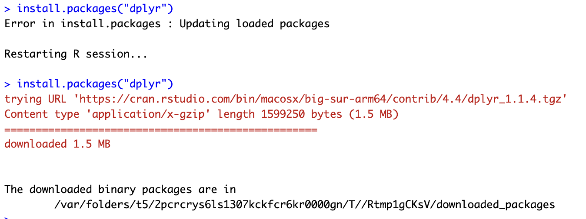

# PR2


# Название

Основы обработки данных с помощью R и Dplyr

## Цель

1.  Развить практические навыки использования языка программирования R для обработки данных
2.  Закрепить знания базовых типов данных языка R
3.  Развить практические навыки использования функций обработки данных пакета dplyr – функции select(), filter(), mutate(), arrange(), group_by()


## Исходные данные

1.  Ноутбук
2.  Условие для практической работы

## Общий план выполнения

1.  Установить пакет dplyr
2.  Проанализировать встроенный в пакет dplyr набор данных starwars с помощью языка R и ответить на вопросы:

-   Сколько строк в датафрейме?
-   Сколько столбцов в датафрейме?
-   Как просмотреть примерный вид датафрейма?
-   Сколько уникальных рас персонажей (species) представлено в данных?
-   Найти самого высокого персонажа.
-   Найти всех персонажей ниже 170
-   Подсчитать ИМТ (индекс массы тела) для всех персонажей. ИМТ подсчитать по формуле
-   Найти 10 самых “вытянутых” персонажей. “Вытянутость” оценить по отношению массы (mass) к росту (height) персонажей.
-   Найти средний возраст персонажей каждой расы вселенной Звездных войн.
-   Найти самый распространенный цвет глаз персонажей вселенной Звездных войн.
-   Подсчитать среднюю длину имени в каждой расе вселенной Звездных войн.

3.  Оформить отчёт в соответсвии с шаблоном

### Шаг 1

Установим пакет dplyr

```{r}
install.packages("dplyr")
```

Пакет установлен: 

Подключим покет

```{r}
library("dplyr")
```

### Шаг 2

#### 1. Сколько строк в датафрейме?

```{r}
starwars %>% 
  nrow()
```

#### 2. Сколько столбцов в датафрейме?

```{r}
starwars %>% 
  ncol()
```

#### 3. Как просмотреть примерный вид датафрейма?

```{r}
starwars %>% 
  glimpse()
```

#### 4. Сколько уникальных рас персонажей (species) представлено в данных?

```{r}
starwars %>% 
  select(species) %>% 
  filter(!is.na(species)) %>% 
  n_distinct()
```

#### 5. Найти самого высокого персонажа.

```{r}
starwars %>% 
  arrange(desc(height)) %>% 
  slice(1) %>% 
  select(name)
```

#### 6. Найти всех персонажей ниже 170

```{r}
starwars %>% 
  filter(height < 170) %>% 
  select(name)
```

#### 7. Подсчитать ИМТ (индекс массы тела) для всех персонажей. ИМТ подсчитать по формуле

```{r}
starwars %>% 
  mutate("I" = mass / height ^ 2) %>% 
  select(name, I)
```

#### 8. Найти 10 самых “вытянутых” персонажей. “Вытянутость” оценить по отношению массы (mass) к росту (height) персонажей.

```{r}
starwars %>% 
  mutate("V" = mass / height) %>% 
  arrange(desc(V)) %>% 
  slice(1:10) %>% 
  select(name, V)
```

#### 9. Найти средний возраст персонажей каждой расы вселенной Звездных войн.

```{r}
starwars %>% 
  group_by(species) %>%
  filter(!is.na(species)) %>%
  select(birth_year) %>%
  filter(!is.na(birth_year)) %>%
  summarize(avg_age = mean(birth_year))
```

#### 10. Найти самый распространенный цвет глаз персонажей вселенной Звездных войн.

```{r}
starwars %>% 
  filter(!is.na(eye_color)) %>%
  group_by(eye_color) %>%
  summarise('count'= n()) %>%
  arrange(desc(count)) %>%
  slice(1)
```

#### 11. Подсчитать среднюю длину имени в каждой расе вселенной Звездных войн.

```{r}
starwars %>%
  filter(!is.na(name)) %>%
  mutate('len' = nchar(name)) %>%
  filter(!is.na(species)) %>%
  group_by(species) %>%
  select(name, len) %>%
  summarize(avg_len = mean(len))
```

### Шаг 3

Отчёт написан и оформлен
