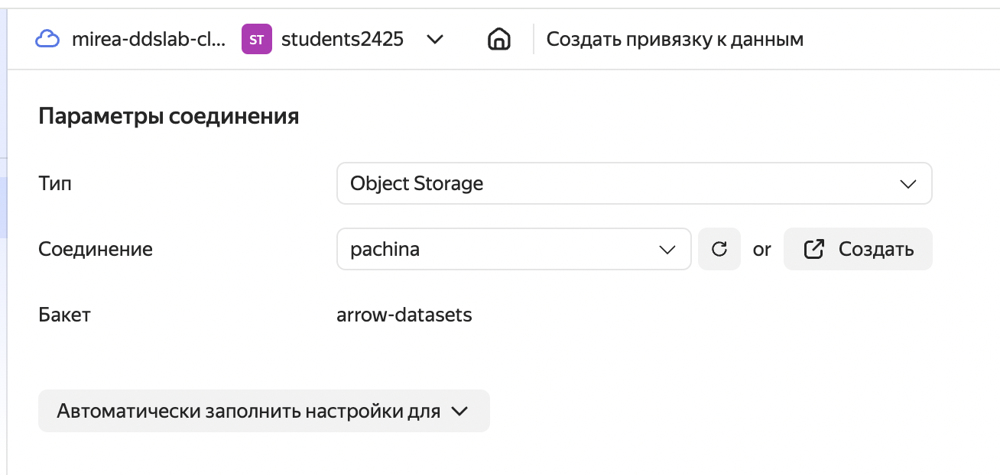
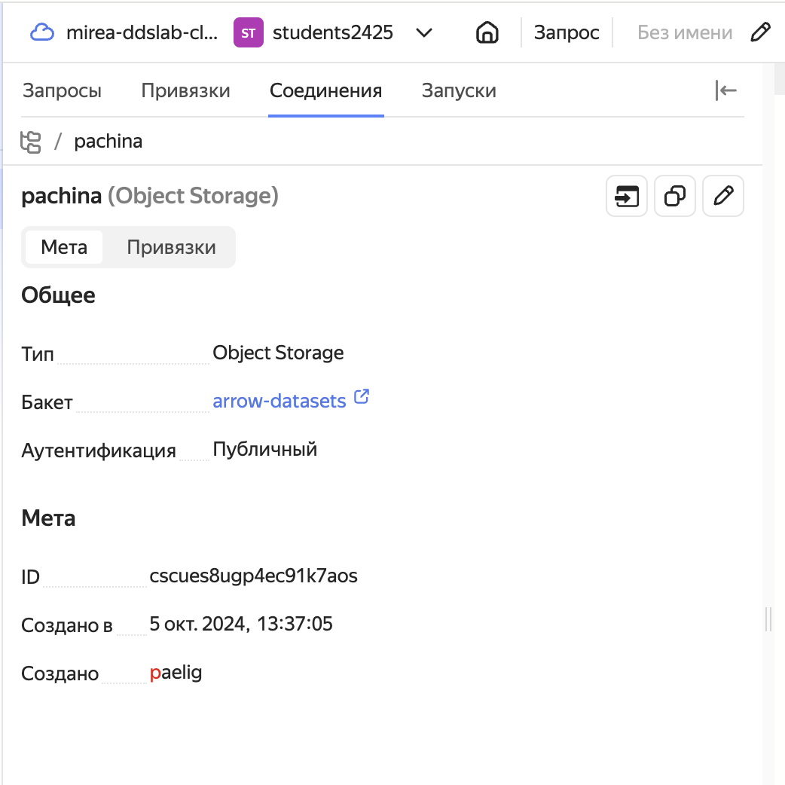
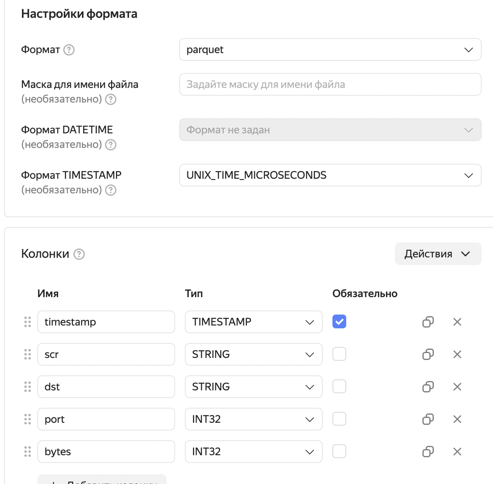
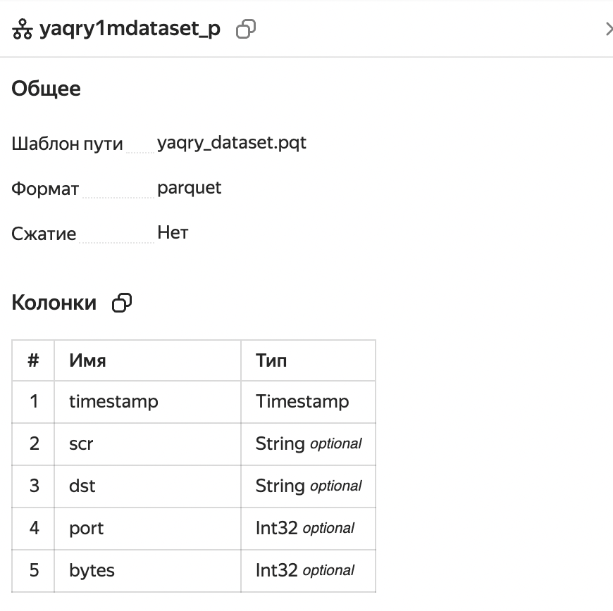
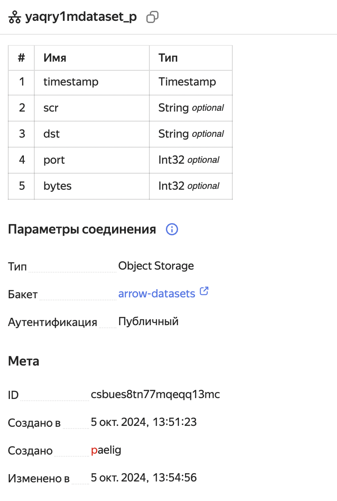
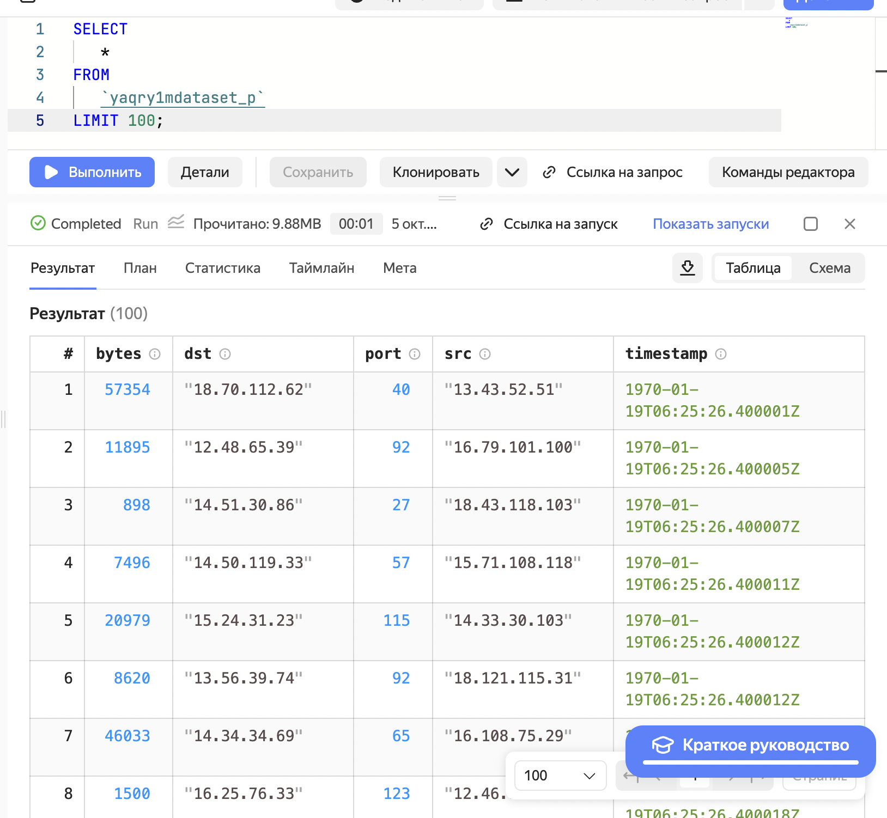
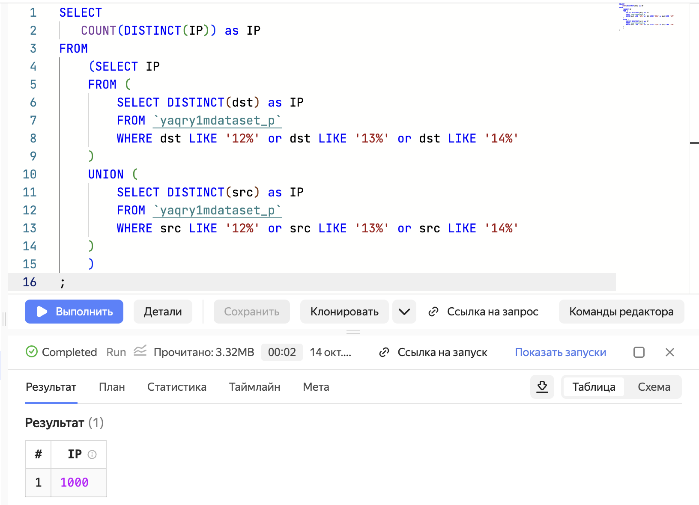

# PR4


# Название

Использование технологии Yandex Query для анализа данных сетевой
активности

## Цель

1.  Изучить возможности технологии Yandex Query для анализа
    структурированных наборов данных
2.  Получить навыки построения аналитического пайплайна для анализа
    данных с помощью сервисов Yandex Cloud
3.  Закрепить практические навыки использования SQL для анализа данных
    сетевой активности в сегментированной корпоративной сети

## Исходные данные

1.  Ноутбук
2.  Условие для практической работы

## Общий план выполнения

1.  Проверить доступность данных в Yandex Object Storage
2.  Подключить бакет как источник данных для Yandex Query
3.  Решить следующие задания:
    1.  Известно, что IP адреса внутренней сети начинаются с октетов,
        принадлежащих интервалу \[12-14\]. Определите количество хостов
        внутренней сети, представленных в датасете.
    2.  Определите суммарный объем исходящего трафика
    3.  Определите суммарный объем входящего трафика
4.  Оформить отчет в соответствии с шаблоном

### Шаг 1

Данные в Yandex Object Storage доступны.

### Шаг 2

Создаём и настраиваем соединение.

  

Создаём и настраиваем привязку.

 

Проверяем корректность соединения:

``` sql
SELECT * FROM `yaqry1mdataset_p` LIMIT 100;
```



### Шаг 3

#### 1. Известно, что IP адреса внутренней сети начинаются с октетов, принадлежащих интервалу \[12-14\]. Определите количество хостов внутренней сети, представленных в датасете.

``` sql
SELECT
   COUNT(DISTINCT(IP)) as IP
FROM
    (SELECT IP 
    FROM (
        SELECT DISTINCT(dst) as IP
        FROM `yaqry1mdataset_p`
        WHERE dst LIKE '12%' or dst LIKE '13%' or dst LIKE '14%'
    )
    UNION (
        SELECT DISTINCT(src) as IP
        FROM `yaqry1mdataset_p`
        WHERE src LIKE '12%' or src LIKE '13%' or src LIKE '14%'
    )
    )
;
```



#### 2. Определите суммарный объем исходящего трафика

#### 3. Определите суммарный объем входящего трафика

### Шаг 4

Отчёт написан и оформлен

``` r
'Готово'
```
