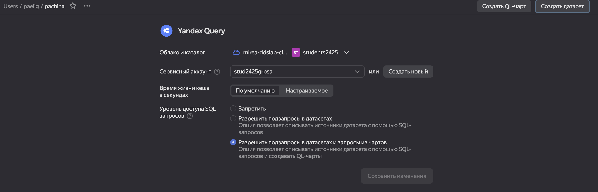

# PR6


# Название

Использование технологии Yandex DataLens для анализа данных сетевой
активности

## Цель

1.  Изучить возможности технологии Yandex DataLens для визуального
    анализа структурированных наборов данных
2.  Получить навыки визуализации данных для последующего анализа с
    помощью сервисов Yandex Cloud
3.  Получить навыки создания решений мониторинга/SIEM на базе облачных
    продуктов и открытых программных решений
4.  Закрепить практические навыки использования SQL для анализа данных
    сетевой активности в сегментированной корпоративной сети

## Исходные данные

1.  Ноутбук
2.  Условие для практической работы

## Общий план выполнения

1.  Настроить подключение к Yandex Query из DataLens
2.  Создать из запроса YandexQuery датасет DataLens
3.  Создать нужные графики и диаграммы
4.  Составить дашборд
5.  Написать отчет

### Шаг 1

Настроим подключение к Yandex Query из DataLens 

### Шаг 2

Создадим из запроса YandexQuery датасет DataLens 

### Шаг 3

Создадим нужные графики и диаграммы

Создадим параметр для типа трафика 

Объём трафика по каждому типу 

Объём трафика, передающегося через 80 порт (http), по типу трафика


Объём трафика по портам 

Объём трафика по портам и типу трафика 

### Шаг 4

Составим дашборды Ссылка на готовый дашборд:
https://datalens.yandex.cloud/vgf2m2lyfxp8i

### Шаг 5

Отчёт написан и офомлен

``` r
'Готово'
```

    [1] "Готово"
