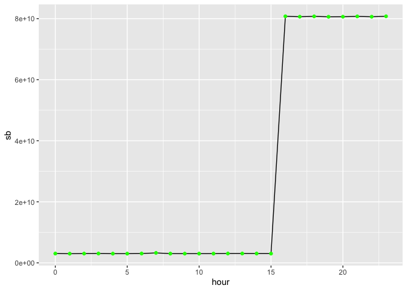
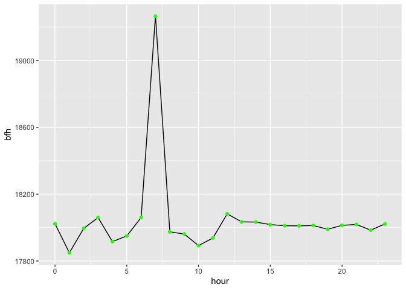
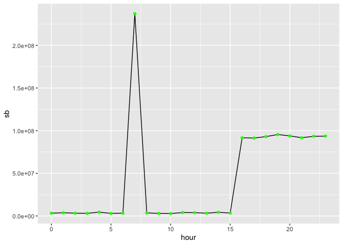
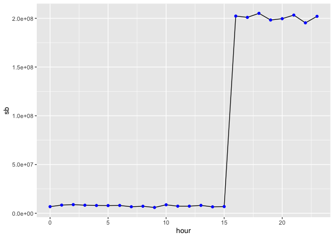
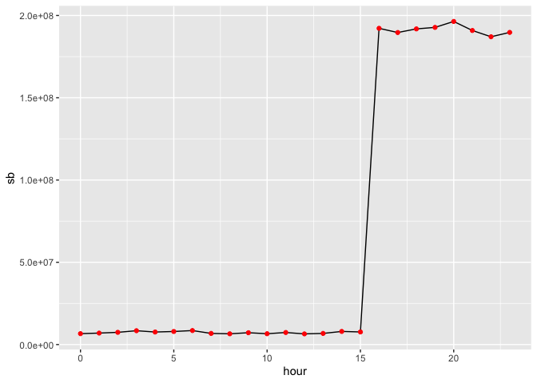

# PR7

# Название

Анализ данных сетевого трафика при помощи библиотеки Arrow

## Цель

1.  Изучить возможности технологии Apache Arrow для обработки и анализ больших данных
2.  Получить навыки применения Arrow совместно с языком программирования R
3.  Получить навыки анализа метаинфомации о сетевом трафике
4.  Получить навыки применения облачных технологий хранения, подготовки и анализа данных: Yandex Object Storage, Rstudio Server.

## Исходные данные

1.  Ноутбук
2.  Условие для практической работы

## Общий план выполнения

1.  Установка пакета arrow
2.  Импорт данных
3.  Обработка данных
    1.  Найти первого нарушителя
    2.  Найти второго нарушителя
    3.  Найти третьего нарушителя
4.  Подготовить и написать отчёт

### Шаг 1 Установка пакета

Установим пакет

``` r
install.packages("arrow")
```

Подключим необходимые пакеты

``` r
library(arrow)
```

```         
Attaching package: 'arrow'

The following object is masked from 'package:utils':

    timestamp
```

``` r
library(dplyr)
```

```         
Attaching package: 'dplyr'

The following objects are masked from 'package:stats':

    filter, lag

The following objects are masked from 'package:base':

    intersect, setdiff, setequal, union
```

``` r
library(tidyverse)
```

```         
── Attaching core tidyverse packages ──────────────────────── tidyverse 2.0.0 ──
✔ forcats   1.0.0     ✔ readr     2.1.5
✔ ggplot2   3.5.1     ✔ stringr   1.5.1
✔ lubridate 1.9.3     ✔ tibble    3.2.1
✔ purrr     1.0.2     ✔ tidyr     1.3.1

── Conflicts ────────────────────────────────────────── tidyverse_conflicts() ──
✖ lubridate::duration() masks arrow::duration()
✖ dplyr::filter()       masks stats::filter()
✖ dplyr::lag()          masks stats::lag()
ℹ Use the conflicted package (<http://conflicted.r-lib.org/>) to force all conflicts to become errors
```

``` r
library(ggplot2)
```

### Шаг 2 Импорт данных

``` r
df <- read_parquet("tm_data.pqt")

df %>% 
  head(1) %>% 
  collect()
```

```         
# A tibble: 1 × 5
      timestamp src         dst           port bytes
          <dbl> <chr>       <chr>        <int> <int>
1 1578326400001 13.43.52.51 18.70.112.62    40 57354
```

### Шаг 3 Обработка данных

По заданию необходимо найти утечки, соотвественно нам необходимы запросы, которые выходят из впутреней сети и выходят во внешнюю. Далее будем использовать только эти данные, поэтому запишем их в отдельный датафрейм и будем использлвать его.

``` r
df_ishod <- df %>% 
  mutate(vnesh = substr(dst, 1, 3)) %>% 
  filter(vnesh != "12." & vnesh != "13." & vnesh != "14.") %>% 
  mutate(vnyt = substr(src, 1, 3)) %>% 
  filter(vnyt == "12." | vnyt == "13." | vnyt == "14.") %>% 
  select(timestamp, src, dst, port, bytes)  %>% 
  collect()

df_ishod %>% nrow()
```

```         
[1] 38598645
```

#### Задание 1: Надите утечку данных из Вашей сети

*Важнейшие документы с результатами нашей исследовательской деятельности в области создания вакцин скачиваются в виде больших заархивированных дампов. Один из хостов в нашей сети используется для пересылки этой информации – он пересылает гораздо больше информации на внешние ресурсы в Интернете, чем остальные компьютеры нашей сети.*

*Определите его IP-адрес.*

``` r
df_ishod %>% 
  group_by(src) %>%
  summarise('sb' = sum(bytes)) %>%
  arrange(desc(sb)) %>%
  head(1) %>%
  select(src) %>%
  collect()
```

```         
# A tibble: 1 × 1
  src         
  <chr>       
1 13.37.84.125
```

#### Задание 2: Надите утечку данных 2

*Другой атакующий установил автоматическую задачу в системном планировщике cron для экспорта содержимого внутренней wiki системы. Эта система генерирует большое количество трафика в нерабочие часы, больше чем остальные хосты.*

*Определите IP этой системы. Известно, что ее IP адрес отличается от нарушителя из предыдущей задачи.*

Исключим из данных, которые мы обрабатываем записи, где ip-адрес отправителя равен 13.37.84.125.

``` r
print(df_ishod %>% nrow())
```

```         
[1] 38598645
```

``` r
df_ishod <- df_ishod %>% 
  filter(src != "13.37.84.125") %>%
  collect()

print(df_ishod %>% nrow())
```

```         
[1] 38543416
```

Определи какие часы будут рабочими для организации. Для этого посмотрим, сколько информации передаётся в каждый час.

``` r
df_hours <- df_ishod %>% 
  mutate(hour = hour(as_datetime(timestamp/1000))) %>%
  group_by(hour) %>%
  summarise('sb' = sum(bytes))%>%
  collect()
```

``` r
ggplot(data = df_hours, aes(x = hour, y = sb)) + 
  geom_point(color="green")
```



Видим, что рабочими являются часы с 16 по 23.

Посмотрим, сколько информации в среднем передаётся с одного хоста в каждый час.

``` r
df_bytes_for_hours <- df_ishod %>% 
  mutate(hour = hour(as_datetime(timestamp/1000))) %>%
  group_by(hour) %>%
  summarise('sb' = sum(bytes), col = n(), bfh = sb/col)%>% 
  collect()
```

``` r
ggplot(data = df_bytes_for_hours, aes(x = hour, y = bfh)) + 
  geom_line() +
  geom_point(color="green")
```



Анамальное соотношение количества передаваемой информации к количеству записей происходит в 7 час, который не является рабочим. Предположим, что утечка происходит в этот час.

``` r
df_ishod %>% 
  mutate(hour = hour(as_datetime(timestamp/1000))) %>%
  filter(hour == 7) %>%
  group_by(src) %>%
  summarise(sb = sum(bytes)) %>%
  arrange(desc(sb)) %>%
  head(5) %>%
  collect()
```

```         
# A tibble: 5 × 2
  src                 sb
  <chr>            <int>
1 12.55.77.96  237116648
2 12.59.25.34    8078495
3 14.51.75.107   7853807
4 12.56.32.111   7029062
5 14.36.60.74    7017017
```

Предположим, что источником утечки является хост 12.55.77.96. Посмотрим, топ-5 тех, кто отправляет информацию в нерабочие часы.

``` r
df_ishod %>% 
  mutate(hour = hour(as_datetime(timestamp/1000))) %>%
  filter(hour < 16) %>%
  group_by(src) %>%
  summarise(sb = sum(bytes)) %>%
  arrange(desc(sb)) %>%
  head(5) %>%
  collect()
```

```         
# A tibble: 5 × 2
  src                 sb
  <chr>            <int>
1 12.55.77.96  289566918
2 13.48.72.30  120862595
3 14.51.30.86  116752466
4 12.59.25.34  115533918
5 14.51.75.107 112816919
```

Посмотрим распледение количества передаваемой информации по часам.

``` r
df1 <- df_ishod %>% 
  mutate(hour = hour(as_datetime(timestamp/1000))) %>%
  filter(src == "12.55.77.96")%>% 
  group_by(hour) %>%
  summarise(sb = sum(bytes)) %>%
  collect()

df2 <- df_ishod %>% 
  mutate(hour = hour(as_datetime(timestamp/1000))) %>%
  filter(src == "13.48.72.30")%>% 
  group_by(hour) %>%
  summarise(sb = sum(bytes)) %>%
  collect()

df3 <- df_ishod %>% 
  mutate(hour = hour(as_datetime(timestamp/1000))) %>%
  filter(src == "14.51.30.86")%>% 
  group_by(hour) %>%
  summarise(sb = sum(bytes)) %>%
  collect()
```

``` r
ggplot(data = df1, aes(x = hour, y = sb)) + 
  geom_line() +
  geom_point(color="green")
```



``` r
ggplot(data = df2, aes(x = hour, y = sb)) + 
  geom_line() +
  geom_point(color="blue")
```



``` r
ggplot(data = df3, aes(x = hour, y = sb)) + 
  geom_line() +
  geom_point(color="red")
```



Видим, что поведение хоста 12.55.77.96 анамально, делаем вывод, что он и является источником утечек.

#### Задание 3: Надите утечку данных 3

Еще один нарушитель собирает содержимое электронной почты и отправляет в Интернет используя порт, который обычно используется для другого типа трафика. Атакующий пересылает большое количество информации используя этот порт, которое нехарактерно для других хостов, использующих этот номер порта.

Определите IP этой системы. Известно, что ее IP адрес отличается от нарушителей из предыдущих задач.

``` r
df_ishod %>% 
  select(port) %>%
  unique() %>%
  arrange(port) %>%
  collect()
```

```         
# A tibble: 47 × 1
    port
   <int>
 1    22
 2    23
 3    25
 4    26
 5    27
 6    29
 7    31
 8    34
 9    37
10    39
# ℹ 37 more rows
```

``` r
df_ishod %>% 
  group_by(port) %>%
  summarise(col = n()) %>%
  select(port, col) %>%
  arrange(desc(col))%>%
  collect()
```

```         
# A tibble: 47 × 2
    port    col
   <int>  <int>
 1    27 965064
 2    80 964250
 3   121 964242
 4    68 964088
 5    79 963603
 6    72 963545
 7    34 963435
 8    77 963423
 9    22 963383
10    96 963075
# ℹ 37 more rows
```
