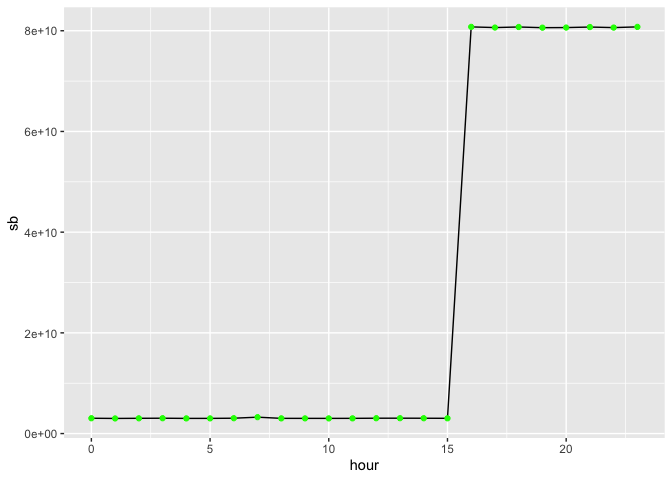
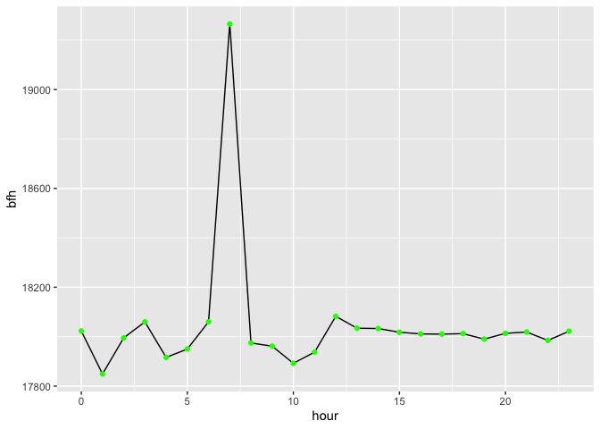
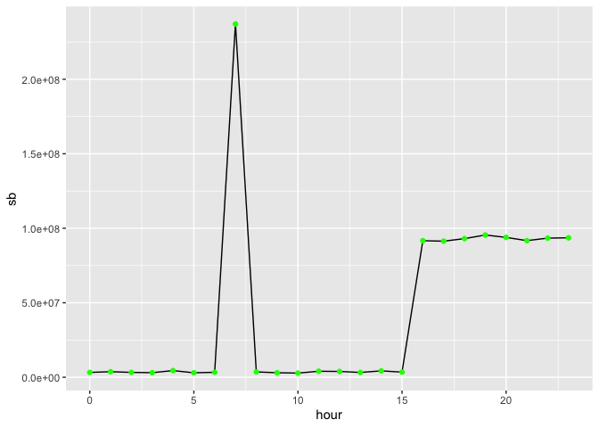
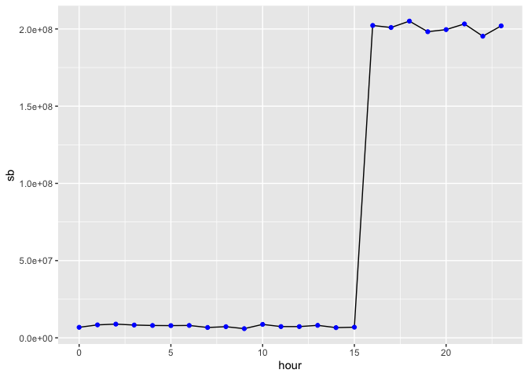
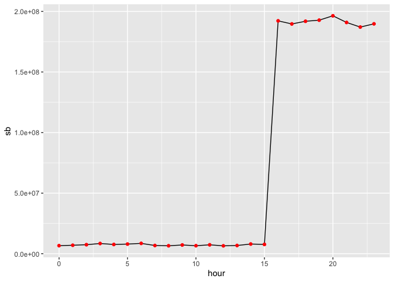
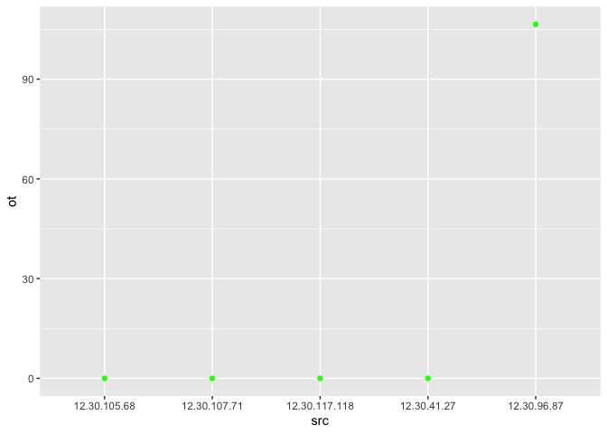
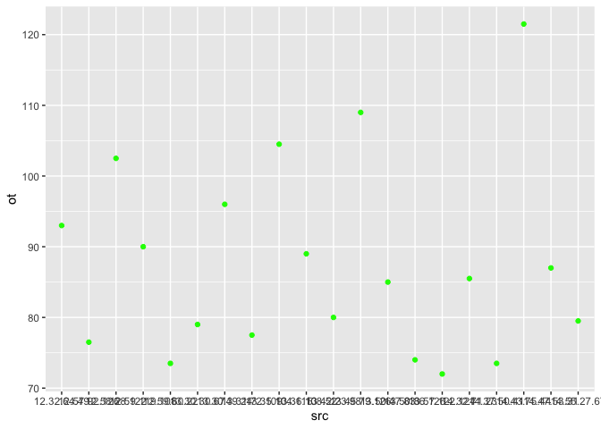
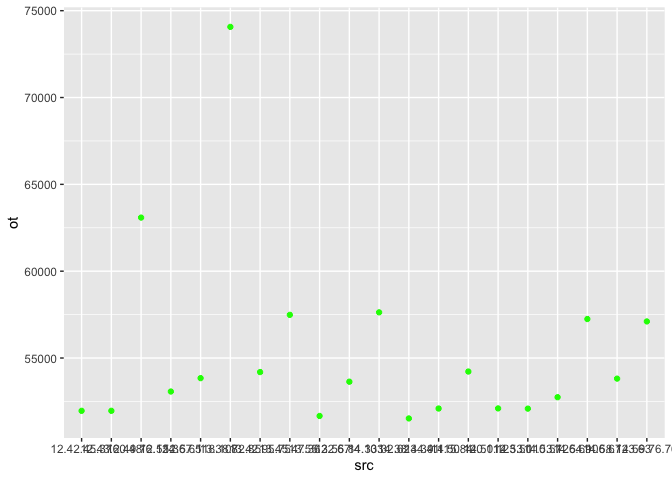
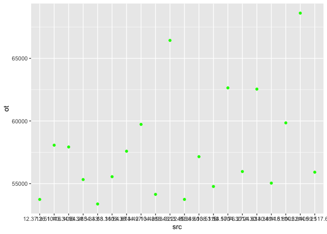

# PR8


# Название

Анализ данных сетевого трафика с использованием аналитической in-memory
СУБД DuckDB

## Цель

1.  Изучить возможности СУБД DuckDB для обработки и анализ больших
    данных
2.  Получить навыки применения DuckDB совместно с языком
    программирования R
3.  Получить навыки анализа метаинфомации о сетевом трафике
4.  Получить навыки применения облачных технологий хранения, подготовки
    и анализа данных: Yandex Object Storage, Rstudio Server.

## Исходные данные

1.  Ноутбук
2.  Условие для практической работы

## Общий план выполнения

1.  Настроить подключение по ssh к RStudio Server
2.  Импортировать данные
3.  Поиск утечек
4.  Написать отчет

### Шаг 1

Скачаем ключ и изменим у него права доступа.

Подключимся используя команду:

    ssh -i <путь к ключу> -L port:127.0.0.1:port user<ВашНомер>@ip-address

Изменим пароль для своего пользователя.

Зайдём в RStudio по адресу: 127.0.0.1:port. Импортируем свой проект из
гита. Теперь всё готово для работы!

### Шаг 2

Загрузим данные с облака

``` r
download.file("https://storage.yandexcloud.net/arrow-datasets/tm_data.pqt", destfile = "tm_data.pqt")
```

Установим необходимые пакеты:

``` r
install.packages("DBI")
```

Подключим необходимые библиотеки:

``` r
library(arrow)
```


    Attaching package: 'arrow'

    The following object is masked from 'package:utils':

        timestamp

``` r
library(dplyr)
```


    Attaching package: 'dplyr'

    The following objects are masked from 'package:stats':

        filter, lag

    The following objects are masked from 'package:base':

        intersect, setdiff, setequal, union

``` r
library(tidyverse)
```

    ── Attaching core tidyverse packages ──────────────────────── tidyverse 2.0.0 ──
    ✔ forcats   1.0.0     ✔ readr     2.1.5
    ✔ ggplot2   3.5.1     ✔ stringr   1.5.1
    ✔ lubridate 1.9.3     ✔ tibble    3.2.1
    ✔ purrr     1.0.2     ✔ tidyr     1.3.1

    ── Conflicts ────────────────────────────────────────── tidyverse_conflicts() ──
    ✖ lubridate::duration() masks arrow::duration()
    ✖ dplyr::filter()       masks stats::filter()
    ✖ dplyr::lag()          masks stats::lag()
    ℹ Use the conflicted package (<http://conflicted.r-lib.org/>) to force all conflicts to become errors

``` r
library(ggplot2)
library(duckdb)
```

    Loading required package: DBI

### Шаг 3

#### Задание 1

*Важнейшие документы с результатами нашей исследовательской деятельности
в области создания вакцин скачиваются в виде больших заархивированных
дампов. Один из хостов в нашей сети используется для пересылки этой
информации – он пересылает гораздо больше информации на внешние ресурсы
в Интернете, чем остальные компьютеры нашей сети. Определите его
IP-адрес.*

Подготовим данные для дальнейшей обработки.

``` r
con <- dbConnect(duckdb::duckdb())
ishod <- dbGetQuery(con, "SELECT * FROM read_parquet('tm_data.pqt') 
                          WHERE (src LIKE '12.%' or src LIKE '13.%' or src LIKE '14.%') 
                                AND 
                                (dst NOT LIKE '12.%' AND 
                                  dst NOT LIKE '13.%' AND dst NOT LIKE '14.%');")
ishod %>% nrow()
```

    [1] 38598645

``` r
ishod %>% 
  group_by(src) %>%
  summarise('sb' = sum(bytes)) %>%
  arrange(desc(sb)) %>%
  head(1) %>%
  select(src) %>%
  collect()
```

    # A tibble: 1 × 1
      src         
      <chr>       
    1 13.37.84.125

#### Задание 2

*Другой атакующий установил автоматическую задачу в системном
планировщике cron для экспорта содержимого внутренней wiki системы. Эта
система генерирует большое количество трафика в нерабочие часы, больше
чем остальные хосты. Определите IP этой системы.*

*Известно, что ее IP адрес отличается от нарушителя из предыдущей
задачи.*

Подготовим данные для задания, исключим из базы данные с ip-адресом из
прошлой задачи.

``` r
ishod <- dbGetQuery(con, "SELECT * FROM read_parquet('tm_data.pqt') 
                          WHERE src != '13.37.84.125'
                                AND
                                (src LIKE '12.%' or src LIKE '13.%' or src LIKE '14.%') 
                                AND 
                                (dst NOT LIKE '12.%' AND 
                                  dst NOT LIKE '13.%' AND dst NOT LIKE '14.%');")
ishod %>% nrow()
```

    [1] 38543416

Определим какие часы будут рабочими для организации. Для этого
посмотрим, сколько информации передаётся в каждый час.

``` r
df_hours <- ishod %>% 
  mutate(hour = hour(as_datetime(timestamp/1000))) %>%
  group_by(hour) %>%
  summarise('sb' = sum(bytes))%>%
  collect()
ggplot(data = df_hours, aes(x = hour, y = sb)) + 
  geom_line() +
  geom_point(color="green")
```



Видим, что рабочими являются часы с 16 по 23.

Посмотрим, сколько информации в среднем передаётся с одного хоста в
каждый час.

``` r
df_bytes_for_hours <- ishod %>% 
  mutate(hour = hour(as_datetime(timestamp/1000))) %>%
  group_by(hour) %>%
  summarise('sb' = sum(bytes), col = n(), bfh = sb/col)%>% 
  collect()
ggplot(data = df_bytes_for_hours, aes(x = hour, y = bfh)) + 
  geom_line() +
  geom_point(color="green")
```



Анамальное соотношение количества передаваемой информации к количеству
записей происходит в 7 час, который не является рабочим. Предположим,
что утечка происходит в этот час.

``` r
ishod %>% 
  mutate(hour = hour(as_datetime(timestamp/1000))) %>%
  filter(hour == 7) %>%
  group_by(src) %>%
  summarise(sb = sum(bytes)) %>%
  arrange(desc(sb)) %>%
  head(1) %>%
  collect()
```

    # A tibble: 1 × 2
      src                sb
      <chr>           <int>
    1 12.55.77.96 237116648

Предположим, что источником утечки является хост 12.55.77.96. Посмотрим,
топ-3 тех, кто отправляет информацию в нерабочие часы.

``` r
ishod %>% 
  mutate(hour = hour(as_datetime(timestamp/1000))) %>%
  filter(hour < 16) %>%
  group_by(src) %>%
  summarise(sb = sum(bytes)) %>%
  arrange(desc(sb)) %>%
  head(3) %>%
  collect()
```

    # A tibble: 3 × 2
      src                sb
      <chr>           <int>
    1 12.55.77.96 289566918
    2 13.48.72.30 120862595
    3 14.51.30.86 116752466

Посмотрим распледение количества передаваемой информации по часам.

``` r
df1 <- ishod %>% 
  mutate(hour = hour(as_datetime(timestamp/1000))) %>%
  filter(src == "12.55.77.96")%>% 
  group_by(hour) %>%
  summarise(sb = sum(bytes)) %>%
  collect()
ggplot(data = df1, aes(x = hour, y = sb)) + 
  geom_line() +
  geom_point(color="green")
```



``` r
df2 <- ishod %>% 
  mutate(hour = hour(as_datetime(timestamp/1000))) %>%
  filter(src == "13.48.72.30")%>% 
  group_by(hour) %>%
  summarise(sb = sum(bytes)) %>%
  collect()
ggplot(data = df2, aes(x = hour, y = sb)) + 
  geom_line() +
  geom_point(color="blue")
```



``` r
df3 <- ishod %>% 
  mutate(hour = hour(as_datetime(timestamp/1000))) %>%
  filter(src == "14.51.30.86")%>% 
  group_by(hour) %>%
  summarise(sb = sum(bytes)) %>%
  collect()
ggplot(data = df3, aes(x = hour, y = sb)) + 
  geom_line() +
  geom_point(color="red")
```



Видим, что поведение хоста 12.55.77.96 анамально, а распределение
передаваемого объёма информации для двух других хостов близко к среднему
распределению по часам.

#### Задание 3

*Еще один нарушитель собирает содержимое электронной почты и отправляет
в Интернет используя порт, который обычно используется для другого типа
трафика. Атакующий пересылает большое количество информации используя
этот порт, которое нехарактерно для других хостов, использующих этот
номер порта.*

*Определите IP этой системы. Известно, что ее IP адрес отличается от
нарушителей из предыдущих задач.*

``` r
ishod <- dbGetQuery(con, "SELECT * FROM read_parquet('tm_data.pqt') 
                          WHERE src != '13.37.84.125'
                                AND
                                src != '12.55.77.96'
                                AND
                                (src LIKE '12.%' or src LIKE '13.%' or src LIKE '14.%') 
                                AND 
                                (dst NOT LIKE '12.%' AND 
                                  dst NOT LIKE '13.%' AND dst NOT LIKE '14.%');")
ishod %>% nrow()
```

    [1] 38498353

Сгруппируем данные по портам и рассчитаем следующие значения: - mean -
среднее значение для bytes - med - медианное значение для bytes - min -
минимальное значение для bytes - max - максимальное значение для bytes -
aver - среднее значение для max и min - r - разница между aver и mean

Если r = 0, то поведение всех хостов стандартно и выбраса в этих данных
нет, значит эти порты нас не интересуют.

``` r
ports <- ishod %>% 
  group_by(port) %>%
  summarise(mean = mean(bytes), 
            med = median(bytes), 
            min = min(bytes),
            max = max(bytes),
            aver = (min+max)/ 2,
            r = abs(aver-mean)) %>%
  filter(r != 0) %>%
  select(port, mean, med, aver, min, max) %>%
  arrange(aver)%>%
  collect()

ports %>% head(5)
```

    # A tibble: 5 × 6
       port   mean   med  aver   min   max
      <int>  <dbl> <dbl> <dbl> <int> <int>
    1   124   42.6    42  148.    42   255
    2    79 1000.    999 1040.   388  1693
    3    94  999.    999 1042.   385  1700
    4    26  999.   1000 1044.   388  1701
    5    61  999.    999 1048    386  1710

``` r
ports %>% tail(5)
```

    # A tibble: 5 × 6
       port   mean    med    aver   min    max
      <int>  <dbl>  <dbl>   <dbl> <int>  <int>
    1    75 35099. 30685   97336.    21 194650
    2    40 35074. 30579   97582.    21 195144
    3   105 35085. 30598.  98894.    21 197766
    4    39 35141. 30713   99274     21 198527
    5    37 35090. 30669  104712.    21 209402

Проанализируем первый и последний порт.

Найдём среднее значение по порту.

``` r
m_124 <- ports %>%
  filter(port == 124) %>%
  select(med) %>%
  collect()

m_124 %>% as.double()
```

    [1] 42

Видим, что средним значениея является 42. Найдём для каждого хоста
отклонение от среднего значения по пору.

``` r
df_124 <- ishod %>% 
  filter(port==124) %>%
  group_by(src) %>%
  summarise(min = min(bytes), 
            max = max(bytes), 
            aver = (min+max)/2,
            ot = as.double(aver - m_124)) %>%
  arrange(desc(ot)) %>%
  select(src, ot) %>%
  head(5) %>%
  collect()

df_124
```

    # A tibble: 5 × 2
      src              ot
      <chr>         <dbl>
    1 12.30.96.87    106.
    2 12.30.105.68     0 
    3 12.30.107.71     0 
    4 12.30.117.118    0 
    5 12.30.41.27      0 

``` r
ggplot(data = df_124, aes(x = src, y = ot)) + 
  geom_point(color="green")
```



Видим, что со всех хостов кроме одного идёт стандартный трафик.
Отличающимся является хост 12.30.96.87.

Проанализируем следующий за 124 порт. Для этого проделаем аналогичные
действия.

``` r
m_79 <- ports %>%
  filter(port == 79) %>%
  select(med) %>%
  collect()
m_79 %>% as.double()
```

    [1] 999

``` r
df_79 <- ishod %>% 
  filter(port==79) %>%
  group_by(src) %>%
  summarise(min = min(bytes), 
            max = max(bytes), 
            aver = (min+max)/2,
            ot = as.double(aver - m_79)) %>%
  arrange(desc(ot)) %>%
  select(src, aver, ot) %>%
  head(20) %>%
  collect()

df_79
```

    # A tibble: 20 × 3
       src            aver    ot
       <chr>         <dbl> <dbl>
     1 14.43.75.44   1120. 122. 
     2 13.45.79.126  1108  109  
     3 13.35.104.115 1104. 104. 
     4 12.58.28.122  1102. 102. 
     5 13.30.49.24   1095   96  
     6 12.32.64.49   1092   93  
     7 12.59.119.108 1089   90  
     8 13.36.108.52  1088   89  
     9 14.47.53.31   1086   87  
    10 14.32.71.23   1084.  85.5
    11 13.50.47.83   1084   85  
    12 13.42.23.98   1079   80  
    13 14.55.27.67   1078.  79.5
    14 13.30.30.67   1078   79  
    15 13.31.72.109  1076.  77.5
    16 12.57.92.126  1076.  76.5
    17 13.50.86.126  1073   74  
    18 12.59.60.22   1072.  73.5
    19 14.37.50.41   1072.  73.5
    20 13.57.122.124 1071   72  

``` r
ggplot(data = df_79, aes(x = src, y = ot)) + 
  geom_point(color="green")
```



Видим, что нет какого-то характерного поведения для хостов и нет скачка
в разнице, а разница уменьшается постепенно.

Проанализируем последний порт. Анализ проведём аналогично.

``` r
m_37 <- ports %>%
  filter(port == 37) %>%
  select(med) %>%
  collect()

m_37 %>% as.double()
```

    [1] 30669

``` r
df_37 <- ishod %>% 
  filter(port==37) %>%
  group_by(src) %>%
  summarise(min = min(bytes), 
            max = max(bytes), 
            aver = (min+max)/2,
            ot = as.double(aver - m_37)) %>%
  arrange(desc(ot)) %>%
  select(src, aver, ot) %>%
  head(20) %>%
  collect()

df_37
```

    # A tibble: 20 × 3
       src              aver     ot
       <chr>           <dbl>  <dbl>
     1 13.38.72.85   104736. 74068.
     2 12.49.76.124   93755  63086 
     3 14.33.32.62    88299  57630 
     4 13.45.47.36    88154. 57486.
     5 14.54.106.67   87914. 57246.
     6 14.59.76.76    87776. 57106.
     7 14.50.120.112  84890  54221 
     8 13.42.95.75    84860. 54192.
     9 12.57.118.108  84510  53841 
    10 14.58.123.63   84482. 53814.
    11 13.55.84.103   84305  53636 
    12 12.55.36.65    83740. 53070.
    13 14.53.126.69   83412  52743 
    14 14.50.123.50   82768. 52098.
    15 14.39.115.84   82761  52092 
    16 14.53.110.57   82754. 52086.
    17 12.43.60.48    82630. 51960.
    18 12.42.45.37    82628. 51960.
    19 13.55.22.67    82333  51664 
    20 14.38.34.41    82190  51521 

``` r
ggplot(data = df_37, aes(x = src, y = ot)) + 
  geom_point(color="green")
```



Видим, что есть нехарактерное поведение для хоста 13.38.72.85.

Проведём сравнение с предыдушем портом.

``` r
m_39 <- ports %>%
  filter(port == 39) %>%
  select(med) %>%
  collect()

m_39 %>% as.double()
```

    [1] 30713

``` r
df_39 <- ishod %>% 
  filter(port==39) %>%
  group_by(src) %>%
  summarise(min = min(bytes), 
            max = max(bytes), 
            aver = (min+max)/2,
            ot = as.double(aver - m_39)) %>%
  arrange(desc(ot)) %>%
  select(src, aver, ot) %>%
  head(20) %>%
  collect()

df_39
```

    # A tibble: 20 × 3
       src             aver     ot
       <chr>          <dbl>  <dbl>
     1 14.52.109.25  99322. 68610.
     2 13.43.22.89   97144. 66432.
     3 13.57.76.27   93354  62641 
     4 14.30.30.49   93258. 62544.
     5 14.51.102.94  90562. 59848.
     6 13.42.104.86  90440  59727 
     7 12.51.116.108 88782. 58068.
     8 13.34.24.28   88638  57925 
     9 13.38.44.97   88299  57586 
    10 13.49.108.116 87864  57151 
    11 14.30.24.63   86678. 55966.
    12 14.59.117.63  86624. 55910.
    13 13.36.84.87   86266. 55552.
    14 13.34.54.33   86037  55324 
    15 14.38.118.80  85754. 55040.
    16 13.53.54.100  85485  54772 
    17 13.42.93.32   84854. 54142.
    18 13.45.36.60   84452. 53740.
    19 12.37.36.104  84450  53737 
    20 13.34.68.110  84087  53374 

``` r
ggplot(data = df_39, aes(x = src, y = ot)) + 
  geom_point(color="green")
```



Видим, что нет значительного выброса, а разница уменьшается постепенно.

Таким образом, нехарактерное поведение у двух хостов:

``` r
df_124 %>% head(1)
```

    # A tibble: 1 × 2
      src            ot
      <chr>       <dbl>
    1 12.30.96.87  106.

``` r
df_37 %>% head(1)
```

    # A tibble: 1 × 3
      src            aver     ot
      <chr>         <dbl>  <dbl>
    1 13.38.72.85 104736. 74068.

### Шаг 4

Отчёт написан и офомлен
